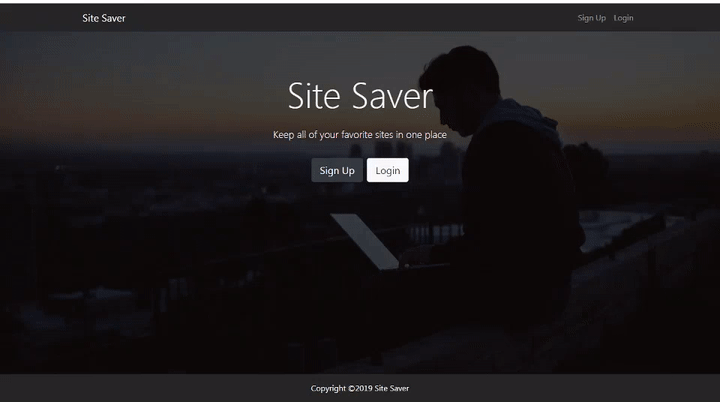
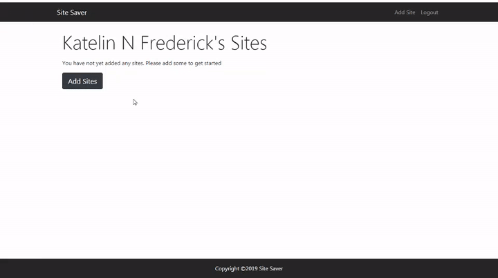

# Site-Saver
App to bookmark your favorite sites

## Description

Web Application that allows the user save their favorite sites

## Author

Katelin Frederick 2019

## Table of Contents
* [About this Project](#about-this-project)
* [Goal of this Project](#goal-of-this-project)
* [Installation](#installation)
* [Technologies](#technologies)
* [What I learned](#what-i-learned)
* [Demos](#demos)

## About this Project
Web application that allows the user to bookmark and save their favorite sites.  After the site is saved, the user can then link to their sites from the dashboard.

## Goal for this Project
The goal of this project was to learn about the MERN stack and MongoDB.

## Installation
```
# Install dependencies for the server
$ npm install

# Install dependencies for the client
$ npm run client-install

# Run the client & server with concurrently
npm run dev

# Run the Express server only
npm run server

# Run the React client only
npm run client

# Server runs on http://localhost:5000 and client on http://localhost:3000
```

## Technologies
* React
* Redux
* Express
* Node.js
* MongoDB
* CSS
* javaScript
* Bootstrap

## What I learned
I learned how to link a React front end with a Node.js backend.  I also learned how to create my own API and database.

## Demos
### SignUp:




### Adding a Site:




### Visiting a Saved Site


